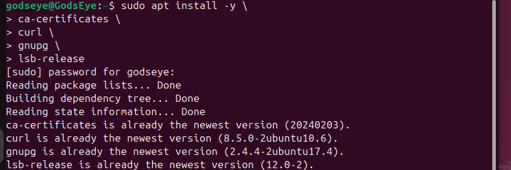
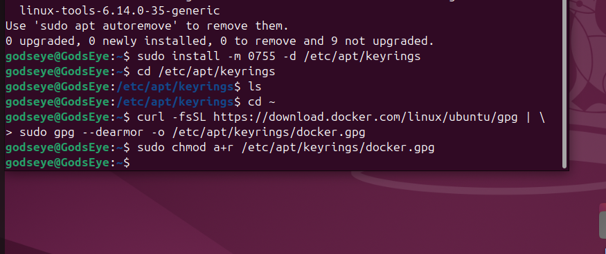
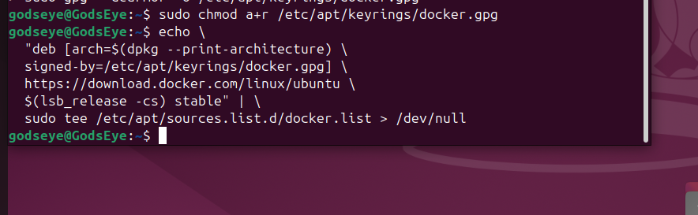
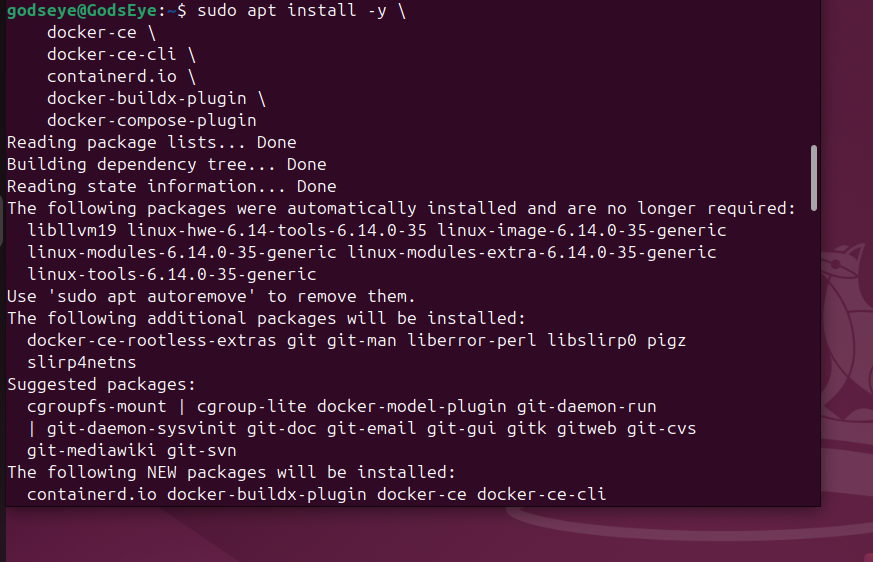
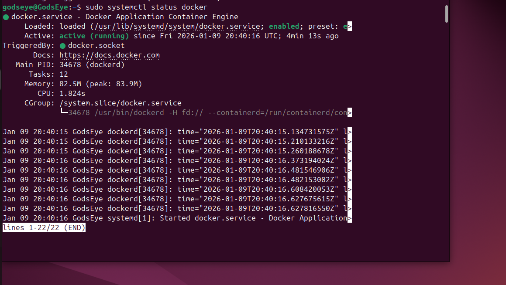
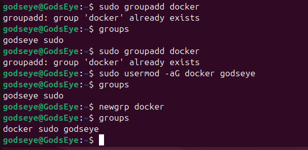
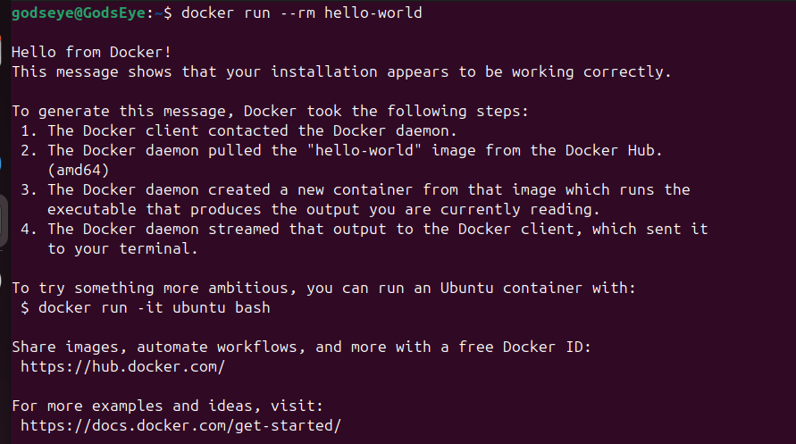

# Docker-Install-With-Security-Configuration
# 🐳 Docker Installation & Security Verification (Home Lab)

A complete walkthrough of how I installed Docker Engine on my Ubuntu VM and verified host security using Docker Bench for Security. This project demonstrates secure installation practices, validation steps, and reproducible documentation with screenshots.

---

## 📌 Project Overview

- **Platform:** Ubuntu VM (Home Lab)
- **Objective:** Install Docker Engine, verify functionality, and run Docker Bench for Security
- **Skills Demonstrated:** Linux administration, secure configuration, vulnerability assessment, documentation

---

## 🖥️ System Information

### OS Version
Ubuntu 22.04 LTS
 


---

# 🚀 Docker Installation Steps

## **Step 1 — Update System Packages**

**Command:**
```bash
sudo apt update && sudo apt upgrade -y
```

## **Step 2 - Install Required Dependencies**
**Command:**
```bash 
sudo apt install -y \
    ca-certificates \
    curl \
    gnupg \
    lsb-release
```


## **Step 3 — Add Docker’s Official GPG Key**
**Command:**
```bash
sudo install -m 0755 -d /etc/apt/keyrings
curl -fsSL https://download.docker.com/linux/ubuntu/gpg | \
    sudo gpg --dearmor -o /etc/apt/keyrings/docker.gpg
sudo chmod a+r /etc/apt/keyrings/docker.gpg
```


## **Step 4 — Add the Docker APT Repository**
**Command:**
```bash
echo \
  "deb [arch=$(dpkg --print-architecture) \
  signed-by=/etc/apt/keyrings/docker.gpg] \
  https://download.docker.com/linux/ubuntu \
  $(lsb_release -cs) stable" | \
  sudo tee /etc/apt/sources.list.d/docker.list > /dev/null
```


## **Step 5 — Update Package Lists (After Adding Repo)**
**Command:**
```
sudo apt update
```
## **Step 6 — Install Docker Engine, CLI, and Containerd**
**Command:**
```
sudo apt install -y \
    docker-ce \
    docker-ce-cli \
    containerd.io \
    docker-buildx-plugin \
    docker-compose-plugin
```


## **Step 7 — Verify Docker Installation**
**Command:**
```
sudo systemctl status docker
Test Container:
sudo docker run --rm hello-world
```


## **Step 8 — Create the Docker Group**
**Command:**
```
sudo groupadd docker
```


**Here you can see me go through the process of confirming if Docker has been added as a group**

## **Step 9 — Add Your User to the Docker Group**
**Command:**
```
sudo usermod -aG docker $USER
```

## **Step 10 — Apply Group Membership Without Logging Out**
**Command:**
```
newgrp docker
```

## **Step 11 — Test Docker Without sudo**
**Command:**
```
docker run --rm hello-world
```


---

# 🔐 Docker Security Hardening Steps (Ubuntu)
- <b>Docker Security Configuration  </b>
  - <a href="https://github.com/Special-K03/Docker-Security-Configuration">Docker Security Configuration</a>
